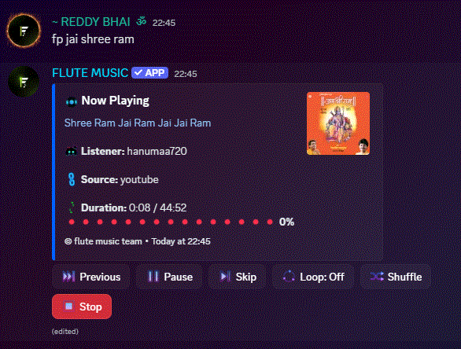

# Flute Music Bot

A Discord music bot with YouTube + Spotify support, filters/effects, playlists, and a live now-playing panel.

## Invite
- Bot: https://discord.com/oauth2/authorize?client_id=1466777461680373820&permissions=281474980236544&scope=bot%20applications.commands
- Support: https://discord.gg/v7StyEvCCC
- Top.gg: https://top.gg/bot/1466777461680373820

## Demo
Short GIF demo:



## Features
- Play music from YouTube, Spotify tracks, and SoundCloud
- Smart search + manual top result picker
- Queue controls, seek, shuffle, loop, replay
- 20+ filters/effects
- User favorites/history and saved playlists
- Website status page + premium modules

## Core Access Policy
Core commands are free by default and not vote-locked:
- `play`, `pause`, `resume`, `skip`, `stop`, `queue`, `nowplaying`, `volume`, `loop`, `shuffle`, `seek`

## Setup
### 1. Prerequisites
- Node.js 18+
- A Lavalink v4 node
- Discord bot token

### 2. Install
```bash
npm install
```

### 3. Configure `.env`
Create `.env` in project root:

```env
# Required
BOT_TOKEN=your_discord_bot_token
LAVALINK_HOST=your_lavalink_host
LAVALINK_PORT=443
LAVALINK_PASSWORD=your_lavalink_password
LAVALINK_SECURE=true

# Optional (Spotify track metadata + better mapping)
SPOTIFY_CLIENT_ID=your_spotify_client_id
SPOTIFY_CLIENT_SECRET=your_spotify_client_secret

# Optional (web + owner)
PORT=10000
OWNER_ID=your_discord_user_id
OWNERS=comma,separated,user_ids

```

### 4. Run
```bash
npm start
```

## Demo Commands
Use prefix `f`:

```text
fhelp
fping
fplay shape of you
fplay https://open.spotify.com/track/... 
fqueue
fskip
fstop
```

## Project Structure
- `index.js` - bot bootstrap and events
- `commands/` - all text commands
- `utils/` - embeds, helpers, premium checks
- `website/` - static status/premium pages
- `server/` - webhook endpoints

## License
MIT
