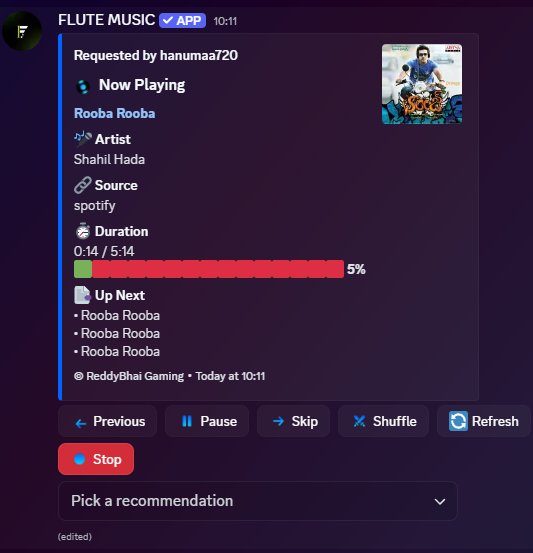
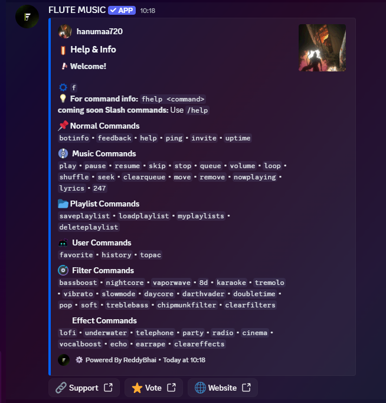

<!-- Animated Header -->
<p align="center">
  
</p>

<p align="center">
  
</p>

<p align="center">
  <a href="https://discord.com/oauth2/authorize?client_id=1466777461680373820&permissions=281474980236544&scope=bot%20applications.commands">
    
  </a>
  <a href="https://discord.gg/A5R9HWGkfF">
    
  </a>
</p>

---

# 🎵 Flute Music Bot

A powerful and lightweight Discord music bot with advanced filters, playlist system, and web dashboard.

👤 code by **Flute Music Team**

---

## 📸 Screenshots

<p align="center">



</p>

---

## ✨ Features

- 🎵 Play high-quality music
- 📃 Advanced queue system
- 🎚️ 20+ audio filters
- 💾 Playlist save/load system
- 🌐 Web status dashboard
- ⚡ Fast Lavalink playback
- 🔊 Volume and seek controls

---

## 💎 Premium Features

Flute Music now supports premium subscriptions through **Razorpay**!

### Plans Available

| Feature | Basic Premium (₹99) | Lifetime Premium |
|---------|---|---|
| All Filters | ✅ | ✅ |
| Advanced Effects | ✅ | ✅ |
| Premium Audio Quality | ✅ | ✅ |
| Priority Support | ✅ | ✅ |
| Lifetime Access | ❌ | ✅ |
| Future Updates | ❌ | ✅ |

### Get Premium

Visit the premium page to purchase:  
👉 **Visit `/premium` on your website**

Or use the Discord command:  
```

---

## 🚀 Invite Bot

Click below to add the bot to your server:

👉 **https://discord.com/oauth2/authorize?client_id=1466777461680373820&permissions=281474980236544&scope=bot%20applications.commands**

---

## 🛠️ Tech Stack

- Node.js
- Discord.js
- Lavalink
- Riffy
- JavaScript

---


## 🎧 Commands

### Music
- play
- skip
- stop
- queue
- volume

### Filters
- bassboost
- nightcore
- vaporwave
- echo
- karaoke

### Info
- help
- ping
- botinfo
- nowplaying

---

## 🌐 Support

Discord Server:  
https://discord.gg/A5R9HWGkfF

---

## 📊 Status

<p align="center">

</p>

---

<p align="center">

</p>